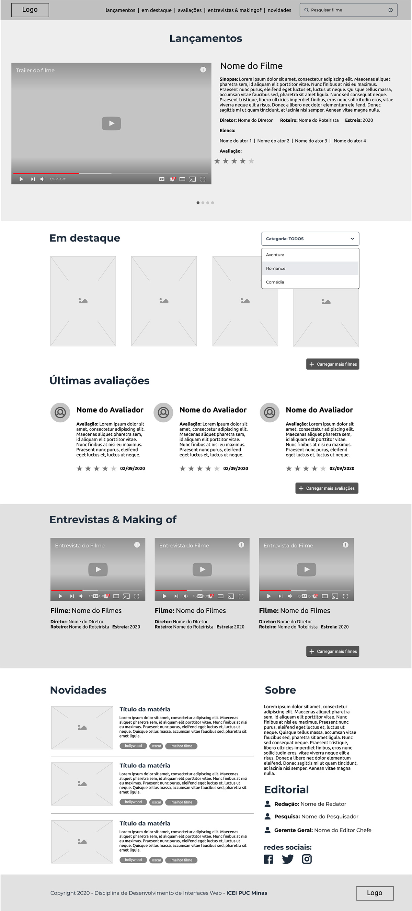

# Scinematic

Este é um projeto de site para um portal de filmes online, apresentado à disciplina de Desenvolvimento de Interfaces Web do curso de Ciência da Computação da Pontifícia Universidade Católica de Minas Gerais pleiteando aprovação.

## Documentação do Projeto

A documentação asseguir foi criada para demonstrar que o site atende a todos os critérios de avaliação definidos para o trabalho.

### Critérios

| Parâmetros   | Pontuação reservada       | Descrição                           | Execução do Parâmetro |
| :---------- | :--------- | :---------------------------------- | :----- |
| `Conformidade com o Wireframe` | `3.0` | O site Sinematic contém todas as estruturas HTML e CSS necessárias para atender e superar as demandas do Wireframe | 100% |
|`Conteúdo`| `2.0` | Sinematic é um site que contém imagens, textos, vídeos e afins, que contemplam o cenário de um site real e atualizado. | 100% |
| `Responsividade do Site` | `5.0` | O site apresenta responsividade funcional já que o conteúdo do site se adapta e se adequa à versão mobile. Além disso os componentes se adaptam ao tamanho do dispositivo, as imagens seguem o padrão do grid e o conteúdo se ajusta à resolução com uso correto de media queries. | 100% |

Veja abaixo a rúbrica disponibilizada pelos orientadores do trabalho para confirmar minhas diretivas: 

### Diretivas Importantes

O site Scinematic foi desenvolvido unica e exclusivamente para ser apresentado à disciplinad de Desenvolvimento de Interfaces Web da _Pontifícia Universidade Católica de Minas Gerais_ e para servir ao portifólio do desenvolvedor **FernandoCsm**. Portanto, qualquer cópia ou replicação do conteúdo (ou parte do conteúdo) deste site é estritamente proibida. Scinematic não foi desenvolvido com o auxílio do Wireframe BootsTrap pois optei por realizar um trabalho integral, que demonstrasse minhas habilidades em codificar nas linguagens **HTML5** & **CSS3**. Todo o **JavaScript** que adicionei ao site está presente para manter os seguintes componentes funcionais: _barra de cookies, carrossel de trailers, estrelas de avaliação e menu mobile_. 

Como o trabalho não exigia e tão pouco restringia o uso da linguagem considere-a como uma adição para melhorar a funcionalidade do site, o que contribuí para minha proficiência na avaliação. 

**Caso queira comprovar minhas habilidades em manipular um Wireframe acesse meu site: [Jealous King](https://jealousking.com.br/).**

