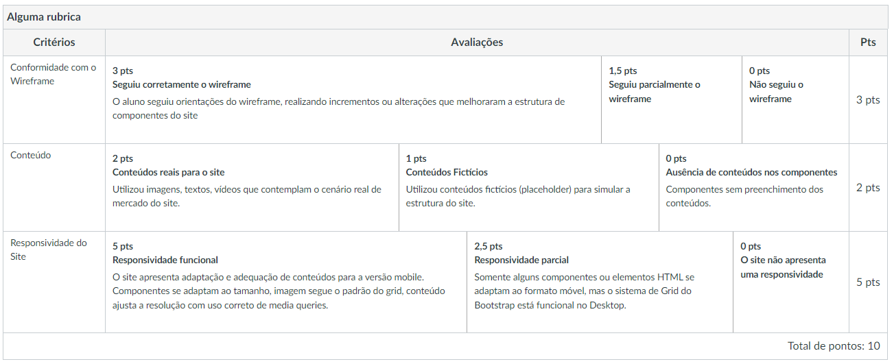
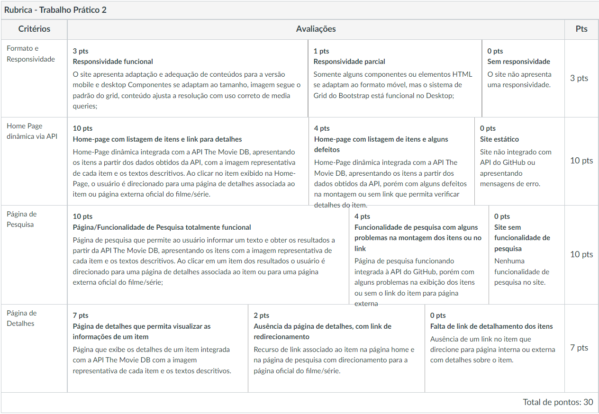

# Scinematic

Este é um projeto de site (portal de filmes), apresentado à disciplina de Desenvolvimento de Interfaces Web do curso de Ciência da Computação da Pontifícia Universidade Católica de Minas Gerais pleiteando aprovação.

> **Desenvolvedor:** Fernando Campos Silva Dal` Maria (FernandoCsm) - **Email:** fernandocsdm@gmail.com
> 
> **Orientador:** Dr. Rommel Vieira Carneiro

## Documentação do Projeto

A documentação a seguir foi criada para demonstrar que o site atende a todos os critérios de avaliação definidos para o trabalho.

**_Observação:_** Esse site também pode ser acessado através do link: [Sinematic](https://scinematic.fernandocsm.repl.co/)

### Nota Sobre a Arquitetura

Observe que o site está organizado em alguns diretórios e subdiretórios. A pasta `assets` contém toda a estrutura do site exceto o HTML da página principal. Dentro de `assets` as seguintes pastas podem ser encontradas: `css`, `icons`, `img`, `javascript` e `pages`. o nome das pastas é auto explicativo, ou seja, dentro de cada uma delas estão conteúdos relacionados com seus nomes. Note que dentro do diretório `css` estão todos os arquivos css do site organizados de acordo com o nome das estruturas às quais pertencem. As demais pastas de `assets` apresentam uma organização semelhante.

### Diretivas Importantes

O site Scinematic foi desenvolvido unica e exclusivamente para ser apresentado à disciplinad de Desenvolvimento de Interfaces Web da _Pontifícia Universidade Católica de Minas Gerais_ e para servir ao portifólio do desenvolvedor **FernandoCsm**. Portanto, qualquer cópia ou replicação do conteúdo (ou parte do conteúdo) deste site é estritamente proibida. 

Scinematic não foi desenvolvido com o auxílio do Wireframe BootsTrap pois optei por realizar um trabalho integral, que demonstrasse minhas habilidades em codificar nas linguagens **HTML5**, **CSS3** & **JavaScript**. No site há links tanto para a página de detalhes feita pelo desenvolvedor **FernandoCsm** quanto para a página da API do `The Movie Database`, para comprovar que sei utilizar os dois tipos de redirecionamento via `JavaScript`. 

Apresento abaixo algumas considerações sobre os critérios de avaliação do trabalho, entretanto, antes de continuar a leitura, lembre-se de que a API do `The Movie Database (TMDb)` é requisito para este projeto e, portanto, está sendo utilizada em todas as páginas do site, exeto na página `privacy-policy.html`.

**Caso queira comprovar minhas habilidades em manipular um Wireframe acesse meu site: [Jealous King](https://jealousking.com.br/).**

> **Nota:** há um "easter egg" no site com o link para o linkedin do professor orientador.

### *Critérios Parte I*

| Parâmetros   | Pontuação reservada       | Descrição                           | Execução do Parâmetro |
| :---------- | :--------- | :---------------------------------- | :----- |
| `Conformidade com o Wireframe` | `3.0` | O site Sinematic contém todas as estruturas HTML e CSS necessárias para atender e superar as demandas do Wireframe. | 100% |
|`Conteúdo`| `2.0` | Sinematic é um site que contém imagens, textos, vídeos e afins, que contemplam o cenário de um site real e atualizado. | 100% |
| `Responsividade do Site` | `5.0` | O site apresenta responsividade, já que o conteúdo do site se adapta e se adequa à versão mobile. Além disso os componentes se adaptam ao tamanho do dispositivo, as imagens seguem o padrão do grid e o conteúdo se ajusta à resolução com uso correto de media queries. | 100% |

Veja abaixo a rúbrica disponibilizada pelos orientadores para confirmar minhas diretivas: 

_**Caso queira conferir se Sinematic está de acordo com o Wireframe, este pode ser encontrado na pasta img do diretório assets, com o nome de layout.jpg.**_

### *Critérios Parte II*

| Parâmetros   | Pontuação reservada       | Descrição                           | Execução do Parâmetro |
| :---------- | :--------- | :---------------------------------- | :----- |
|`Formato e Responsividade`|`3.0`| O site Scinematic manteve sua responsividade e a aprimorou implementando novos recursos e uma melhor interatividade. Repare também que todas as páginas do site estão responsivas. |100%|
|`Home Page dinâmica via API`|`10.0`| A home do site está totalmente funcional e dinâmica, conforme exigido nos requisitos. Repare a presença tanto de filmes quanto séries na página principal. |100%|
|`Página de Pesquisa`|`10.0`| A página de pesquisa do site está funcionando corretamente e retornando resultados adequados para cada pesquisa. Ela pode ser acessada pelo cabeçalho do site e pelo arquivo `pesquisa.html`. Note também que ao clicar em um cartão da pesquisa você é redirecionado para a página de detalhes. |100%|
|`Página de Detalhes`|`7.0`| A página de detalhes do Scinematic pode ser acessada ao clicar em algum cartão presente na Home Page ou na página de pesquisa. O acesso direto pode ser feito através do arquivo `detalhes.html`. A página de detalhes apresenta detalhes sobre o item selecionada e está devidamente integrada com a API do TMDB. |100%|

## Referência

 - [Mozilla MDN Web Docs](https://developer.mozilla.org/pt-BR/)
 - [W3schools](https://www.w3schools.com/)
 - [W3C](https://www.w3.org/)
 - [TMDB](https://www.themoviedb.org/)
 - DUCKETT, J. **HTML & CSS: design and build websites**. indianapolis, Indiana: Wiley. 2011.
 - CASTRO, E. & HYSLOP, B. **HTML5 and CSS3: Visual QuickStart Guide** ed. 7. Peachpit Press. 2012.
 - [ACM](https://dl.acm.org/)
 - [IEEE Xplore](https://ieeexplore.ieee.org/search/searchresult.jsp?newsearch=true&queryText=computer)
 - [LGPD](https://www.gov.br/cidadania/pt-br/acesso-a-informacao/lgpd)

## Informações adicionais sobre o Desenvolvedor: 

 - [Linkedin](https://www.linkedin.com/in/fernandocsdm/)
 - [Site Pessoal](https://jealousking.com.br/desenvolvedor/)
 - [Lattes](http://lattes.cnpq.br/7942914068914499)
 - [GitHub](https://github.com/FernandoCsm-Knight)

#### DATA DE ATUALIZAÇÃO DO PROJETO: 

> 20/06/2022
